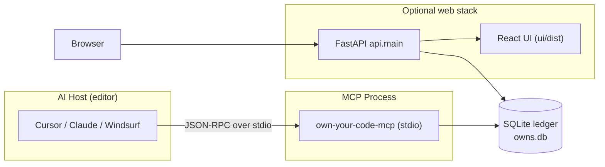

# Own Your Code

<p align="center">
  <strong>A living intent ledger for your codebase.</strong><br/>
  <sub>Capture the <em>why</em> behind every function — via MCP — and explore it in a browser or over REST.</sub>
</p>

<p align="center">
  <a href="https://pypi.org/project/own-your-code/"></a>
  
  
  <a href="https://github.com/khirodsahoo93/mcp-own-your-code"></a>
</p>

**Own Your Code** is an open-source **[Model Context Protocol](https://modelcontextprotocol.io/) (MCP) server** and optional **FastAPI + React** web app that maintains an **intent ledger** (SQLite). For each function in your codebase, it captures *why* it exists, what tradeoffs were considered, and how it has evolved over time — making your codebase understandable to both humans and AI.

Works with: **Cursor**, **Claude Desktop**, **Claude Code**, **Windsurf**, **VS Code** (with MCP), and any other MCP-capable host.

**Package name:** `own-your-code` on PyPI. **Repository:** [`mcp-own-your-code`](https://github.com/khirodsahoo93/mcp-own-your-code).

---

## Where to find Own Your Code

| Where | Link |
|-------|------|
| **PyPI** | [`pypi.org/project/own-your-code`](https://pypi.org/project/own-your-code/) |
| **GitHub** | [`github.com/khirodsahoo93/mcp-own-your-code`](https://github.com/khirodsahoo93/mcp-own-your-code) |
| **npm shim** | [`npmjs.com/package/own-your-code-mcp`](https://www.npmjs.com/package/own-your-code-mcp) |

---

## Table of contents

1. [Why Own Your Code?](#why-own-your-code)
2. [What you get](#what-you-get)
3. [Architecture](#architecture)
4. [Requirements](#requirements)
5. [Quick start (5 steps)](#quick-start-5-steps)
6. [Installation](#installation)
7. [Editor setup (per-editor)](#editor-setup-per-editor)
8. [Your first session](#your-first-session)
9. [MCP tools reference](#mcp-tools-reference)
10. [Terminal CLI reference](#terminal-cli-reference)
11. [Web UI and REST API](#web-ui-and-rest-api)
12. [REST API reference](#rest-api-reference)
13. [Search modes](#search-modes)
14. [Optional extras](#optional-extras)
15. [Environment variables](#environment-variables)
16. [Post-write hook](#post-write-hook)
17. [Long-running tools and limits](#long-running-tools-and-limits)
18. [Production deployment](#production-deployment)
19. [Development](#development)
20. [Database schema](#database-schema)
21. [Troubleshooting](#troubleshooting)
22. [Publishing (maintainers)](#publishing-maintainers)
23. [Documentation map](#documentation-map)
24. [License](#license)

---

## Why Own Your Code?

Code explains *what* — your history of decisions explains *why*. When you return to a function six months later (or when an AI tries to help you change it), the context is gone. Reviewers ask "why is this here?" Pull requests lose the reasoning thread.

**Own Your Code** solves this by making intent capture a first-class part of your workflow:

- Every time you write or modify a function, record *why* it exists and what decision you made.
- When you return to it later, `explain_function` surfaces the full story — original request, decisions, every change with its reason.
- The codebase map shows coverage (what % of functions have intent recorded) and highlights what still needs annotation.
- Semantic search lets you find functions by *purpose*, not just name.

---

## What you get

| Feature | Description |
|---------|-------------|
| **Intent capture** | Record user request, reasoning, implementation notes, confidence level per function. |
| **Decision log** | Capture tradeoffs and alternatives considered at decision time. |
| **Evolution timeline** | Append a change entry whenever behavior is modified; Git hash is captured automatically. |
| **Multi-language indexing** | Python (built-in), TypeScript, JavaScript, Go (via optional tree-sitter). |
| **Three search modes** | Keyword (fast), semantic (embedding-based), hybrid (blended). |
| **Coverage map** | See which functions are annotated and which still need attention. |
| **MCP surface** | AI agents call tools directly from the editor. |
| **CLI surface** | Same database, same project — use from the terminal without an AI host. |
| **FastAPI + React UI** | Browse the map, search, inspect timelines in a browser. |
| **Post-write hook** | Editor hook populates a backlog of files to annotate after each write. |

---

## Architecture



**Key points:**

- The MCP server and the REST API share **one SQLite file** (path from `OWN_YOUR_CODE_DB`, or a default location).
- **One MCP binary** serves all your projects. The active project is always identified by `project_path` on each tool call.
- The web stack (FastAPI + React) is **optional** — MCP works without it.

---

## Requirements

- **Python 3.11, 3.12, or 3.13** — all tested in CI.
- **Node.js 18+** — only needed if you build the React UI from source.
- **No database server** — SQLite is embedded.

---

## Quick start (5 steps)

| Step | What to do |
|:----:|-----------|
| 1 | Install: `pipx install own-your-code` |
| 2 | Wire your editor: `own-your-code install` (or see [per-editor setup](#editor-setup-per-editor)) |
| 3 | Restart your editor so it picks up the new MCP config |
| 4 | In the AI chat, call `register_project` with the path to your repo |
| 5 | While coding, call `record_intent` after every function you write or change |

---

## Installation

### Option A — pipx (recommended for most users)

`pipx` installs CLI tools in isolation and puts them on your PATH automatically.

```bash
pipx install own-your-code
own-your-code install          # writes MCP config for your editor
```

First time: follow the prompt if pipx asks you to add `~/.local/bin` to PATH.

### Option B — pip in a virtual environment

```bash
python3 -m venv ~/.venvs/oyc
source ~/.venvs/oyc/bin/activate    # Windows: .venvs\oyc\Scripts\activate
pip install own-your-code
own-your-code install
```

When you configure your editor, use the **full path** to the binary:

```bash
which own-your-code-mcp    # copy this path into the MCP config command
```

### Option C — npm shim (still requires Python 3.11+)

```bash
npx own-your-code-mcp install
```

This checks for the Python package, installs it if needed, then runs `own-your-code install`. Prefer the native Python binary for lower latency.

### Option D — from source

```bash
git clone https://github.com/khirodsahoo93/mcp-own-your-code
cd mcp-own-your-code
python3 -m venv .venv && source .venv/bin/activate
pip install -e .

# Optional extras:
pip install -e ".[semantic]"       # semantic/hybrid search
pip install -e ".[full]"           # semantic + TypeScript/JavaScript/Go indexing
pip install -e ".[dev,full]"       # full + pytest + ruff
```

### Optional extras

| Extra | What it adds |
|-------|-------------|
| `pip install "own-your-code[semantic]"` | `sentence-transformers`, `numpy` — needed for semantic/hybrid search |
| `pip install "own-your-code[multilang]"` | `tree-sitter` grammars for TypeScript, JavaScript, Go |
| `pip install "own-your-code[full]"` | Both semantic and multilang |
| `pip install "own-your-code[dev]"` | pytest, httpx, ruff — for contributors |

---

## Editor setup (per-editor)

After installing, run `own-your-code install --platform <id>` to write the MCP config automatically. Or use `own-your-code print-config` to get the JSON and merge it manually.

**Always restart the editor after changing MCP config.**

### Cursor

```bash
own-your-code install --platform editor-a
```

Edits `~/.cursor/mcp.json`. Manual config:

```json
{
  "mcpServers": {
    "own-your-code": {
      "command": "own-your-code-mcp",
      "args": [],
      "env": {}
    }
  }
}
```

If `own-your-code-mcp` is not on PATH (pip in venv, no pipx), use the full path instead:

```json
{
  "mcpServers": {
    "own-your-code": {
      "command": "/Users/you/.venvs/oyc/bin/own-your-code-mcp",
      "args": [],
      "env": {}
    }
  }
}
```

### Claude Desktop

```bash
own-your-code install --platform editor-b
```

Edits `~/Library/Application Support/Claude/claude_desktop_config.json` (macOS) or `%APPDATA%\Claude\claude_desktop_config.json` (Windows).

### Windsurf / Codeium

```bash
own-your-code install --platform editor-c
```

Edits `~/.codeium/windsurf/mcp_config.json`.

### Claude Code CLI

```bash
own-your-code install --platform claude-code
```

Edits `~/.claude.json`.

### VS Code with MCP extension

Use `own-your-code print-config` to get the server block and add it to your MCP configuration file per your extension's docs.

### All editors at once

```bash
own-your-code install --platform all
```

### Check without writing

```bash
own-your-code install --dry-run
```

### From a git checkout (not a pip/pipx install)

```json
{
  "mcpServers": {
    "own-your-code": {
      "command": "/path/to/mcp-own-your-code/.venv/bin/python",
      "args": ["-m", "src.server"],
      "cwd": "/path/to/mcp-own-your-code"
    }
  }
}
```

---

## Your first session

This section shows a realistic workflow: registering a project, recording intent while writing code, and retrieving it later.

### 1. Register your project

In the AI chat:

```
register_project path="/Users/you/projects/my-app"
```

This walks the directory tree, extracts every function in Python/TypeScript/JavaScript/Go files, and stores them in the database. You only need to do this once per project (or after adding many new files).

The response tells you how many functions were found and how many are new:

```json
{
  "status": "registered",
  "functions_found": 142,
  "new_or_changed": 142,
  "by_language": { "python": 120, "typescript": 22 },
  "parse_errors": []
}
```

### 2. Write a function and record intent immediately

While writing code (example in Python):

```python
def verify_token(token: str) -> dict:
    """Verify JWT and return claims."""
    ...
```

Right after writing it, call `record_intent` in the AI chat:

```
record_intent
  project_path="/Users/you/projects/my-app"
  file="src/auth.py"
  function_name="verify_token"
  user_request="Add JWT verification so the API rejects unsigned requests"
  reasoning="RS256 asymmetric keys chosen so verify-only services never need the private key"
  decisions=[{"decision":"Use PyJWT","reason":"Mature library with RS256 support","alternatives":["python-jose","authlib"]}]
  confidence=5
```

**Minimum viable call** — just `user_request`, everything else optional:

```
record_intent
  project_path="/Users/you/projects/my-app"
  file="src/auth.py"
  function_name="verify_token"
  user_request="Add JWT verification so the API rejects unsigned requests"
```

### 3. Look up why a function exists

```
explain_function
  project_path="/Users/you/projects/my-app"
  function_name="verify_token"
```

Returns the full story: original request, reasoning, every decision, and the change timeline.

### 4. Record a change

When you later modify `verify_token` to add audience validation:

```
record_evolution
  project_path="/Users/you/projects/my-app"
  file="src/auth.py"
  function_name="verify_token"
  change_summary="Added aud claim validation; rejects tokens issued for other services"
  reason="Security audit finding: tokens accepted cross-service"
  triggered_by="CVE review Q1 2026"
```

### 5. Get a coverage map

```
get_codebase_map project_path="/Users/you/projects/my-app"
```

Returns all functions grouped by file, coverage percentage, and a `hook_backlog` listing files that were edited but not yet annotated.

### 6. Search by intent

```
find_by_intent
  project_path="/Users/you/projects/my-app"
  query="authentication and token validation"
  mode="keyword"
```

For semantic/vector search (requires `pip install "own-your-code[semantic]"` and running `embed_intents` first):

```
find_by_intent
  project_path="/Users/you/projects/my-app"
  query="authentication and token validation"
  mode="hybrid"
```

---

## MCP tools reference

These are the tools your AI assistant can call. All tools return JSON.

### `register_project`

Scan and index a codebase. Run once per project, or re-run to pick up new files.

| Parameter | Type | Required | Description |
|-----------|------|----------|-------------|
| `path` | string | Yes | Absolute path to the project root |
| `name` | string | No | Human-readable project name |
| `languages` | list[str] | No | Restrict to `["python"]`, `["typescript","javascript"]`, `["go"]`, etc. |
| `include_globs` | list[str] | No | Only index files matching these patterns, e.g. `["src/**/*.py"]` |
| `ignore_dirs` | list[str] | No | Additional directories to skip (beyond built-in defaults) |

**Built-in skips:** `node_modules`, `.git`, `.venv`, `__pycache__`, `dist`, `build`, `site-packages`, `.pytest_cache`, `.ruff_cache`, `htmlcov`, `*.egg-info`, and similar tooling/dependency paths.

**Returns:** counts of functions found, new/changed, by language, and any parse errors.

---

### `record_intent`

**Call this every time you write or significantly modify a function.** Records why the function exists.

| Parameter | Type | Required | Description |
|-----------|------|----------|-------------|
| `project_path` | string | Yes | Absolute path to the project root |
| `file` | string | Yes | Path relative to project root (e.g. `src/auth.py`) |
| `function_name` | string | Yes | Fully qualified name (e.g. `MyClass.verify_token` or `verify_token`) |
| `user_request` | string | Yes | The user request or feature that caused this function to be written |
| `reasoning` | string | No | How and why this implementation approach was chosen |
| `implementation_notes` | string | No | Any gotchas, assumptions, or follow-up work |
| `feature` | string | No | Group this function under a named feature |
| `decisions` | list[Decision] | No | Tradeoffs: `[{"decision":"...","reason":"...","alternatives":["..."]}]` |
| `confidence` | int 1–5 | No | How confident the intent is (5 = certain, 1 = inferred guess). Default: 5 |

Side effect: clears the post-write hook backlog for this file.

---

### `record_evolution`

Call when you **modify** an existing function (not create it). Appends a change entry to the timeline.

| Parameter | Type | Required | Description |
|-----------|------|----------|-------------|
| `project_path` | string | Yes | Project root |
| `file` | string | Yes | Relative file path |
| `function_name` | string | Yes | Function name (must already exist in the DB) |
| `change_summary` | string | Yes | What changed in this modification |
| `reason` | string | No | Why this change was made |
| `triggered_by` | string | No | User request, ticket, incident, etc. that caused the change |

Git hash is captured automatically if the path is a git repo. Works without git too — just leave `triggered_by` / `reason` with the relevant context.

---

### `explain_function`

Get the full story of a function: why it exists, decisions made, and how it changed.

| Parameter | Type | Required | Description |
|-----------|------|----------|-------------|
| `project_path` | string | Yes | Project root |
| `function_name` | string | Yes | Function name |
| `file` | string | No | Disambiguates if multiple functions share a name across files |

**Returns:** `exists_because`, `how_it_works`, `decisions`, `evolution` timeline, `full_intent_history`.

---

### `get_codebase_map`

Living map of the full codebase: every function, its intent (if recorded), coverage percentage, and the hook backlog (files edited but not yet annotated).

| Parameter | Type | Required | Description |
|-----------|------|----------|-------------|
| `project_path` | string | Yes | Project root |

**Returns:** coverage stats, `by_file` map grouped by file with per-function intent summaries, `features` list, `hook_backlog` list.

> **Note on large codebases:** this makes one DB round-trip per function. On very large projects (thousands of functions), it may be slow and return a large JSON payload. Narrow with `file` if you only need one file's data.

---

### `find_by_intent`

Search for functions by intent/purpose.

| Parameter | Type | Required | Description |
|-----------|------|----------|-------------|
| `project_path` | string | Yes | Project root |
| `query` | string | Yes | Natural-language search phrase |
| `mode` | string | No | `"keyword"` (default), `"semantic"`, or `"hybrid"` |
| `limit` | int 1–200 | No | Max results. Default: 20 |
| `semantic_weight` | float 0–1 | No | Weight for semantic score in hybrid mode. Default: 0.5 |

`"semantic"` and `"hybrid"` require the `semantic` extra and `embed_intents` to have been run first.

---

### `embed_preflight`

Fast check: is the semantic stack installed? How many intents still need embeddings? No model is loaded.

| Parameter | Type | Required | Description |
|-----------|------|----------|-------------|
| `project_path` | string | Yes | Project root |
| `model` | string | No | Embedding model name. Default: `all-MiniLM-L6-v2` |

Call this before `embed_intents` to confirm readiness and check for large backlogs.

---

### `embed_intents`

Compute and store vector embeddings for all unannotated intents. Required before semantic/hybrid search.

| Parameter | Type | Required | Description |
|-----------|------|----------|-------------|
| `project_path` | string | Yes | Project root |
| `model` | string | No | Embedding model. Default: `all-MiniLM-L6-v2` |

Safe to re-run — only processes intents not yet embedded. First run may download model weights (requires internet). For offline use, see [Environment variables](#environment-variables).

> **Warning:** can be slow and memory-intensive for large backlogs. See [Long-running tools and limits](#long-running-tools-and-limits).

---

### `get_evolution`

Full timeline of how a function changed over time.

| Parameter | Type | Required | Description |
|-----------|------|----------|-------------|
| `project_path` | string | Yes | Project root |
| `function_name` | string | Yes | Function name |
| `file` | string | No | Disambiguates across files |

**Returns:** `original_intent`, `evolution` list (what/why/when/git hash), `intent_history`.

---

### `annotate_existing`

Retrofit intent onto a codebase that predates Own Your Code. Use this on a project you're onboarding.

**Two-phase workflow:**

1. Call with no `file` and no `annotations` → returns a list of all unannotated functions grouped by file.
2. For each file, read the source, infer the intent, then call with `file` and `annotations`.

| Parameter | Type | Required | Description |
|-----------|------|----------|-------------|
| `project_path` | string | Yes | Project root |
| `file` | string | No | Relative file path to annotate |
| `annotations` | list[Annotation] | No | `[{"function_name":"...","user_request":"...","reasoning":"...","confidence":2}]` |

Use `confidence=1–2` when inferring from code rather than recalling from memory.

---

### `mark_file_reviewed`

Clear the post-write hook backlog for a file without recording new intent. Use for typo-only changes or cases where you will annotate later.

| Parameter | Type | Required | Description |
|-----------|------|----------|-------------|
| `project_path` | string | Yes | Project root |
| `file` | string | Yes | Relative file path |
| `note` | string | No | Optional explanation of why no annotation was needed |

---

### `check_dependencies`

Report which optional packages are installed. Fast — uses `importlib.util.find_spec` only, no model loading.

No parameters required.

---

## Terminal CLI reference

All CLI commands use the same SQLite database as MCP. No AI host required.

```bash
own-your-code --help
```

| Command | Description |
|---------|-------------|
| `own-your-code install [--platform ID] [--dry-run]` | Merge MCP server block into host config files. IDs: `editor-a` (Cursor), `editor-b` (Claude Desktop), `editor-c` (Windsurf), `claude-code`, `all` |
| `own-your-code print-config` | Print the `mcpServers` JSON fragment for manual use |
| `own-your-code deps [--json]` | Show optional package status (semantic, multilang, dev) |
| `own-your-code status [--project-path P]` | Show DB path and project stats. Defaults to cwd if inside a registered project |
| `own-your-code update [PATH]` | Scan/index a project. PATH defaults to current directory |
| `own-your-code prune [PATH] [--dry-run]` | Remove stale function rows not found in a fresh scan. Run `--dry-run` first |
| `own-your-code visualize [--project-path P] --out report.html` | Export a standalone HTML coverage report |
| `own-your-code watch [--project-path P] [--interval N]` | Print coverage stats on a repeating interval |

**Environment variable:** `OWN_YOUR_CODE_DB=/absolute/path/to/file.db` to point all CLI commands at a specific database.

---

## Web UI and REST API

The FastAPI + React web app is optional and separate from the MCP server. They share the same SQLite database.

### Start the API server

From the **repository root** (where `api/` and `pyproject.toml` live):

```bash
pip install -e .                                # or ensure fastapi + uvicorn are installed
cd ui && npm ci && npm run build && cd ..       # build the React UI (first time)
uvicorn api.main:app --reload --host 127.0.0.1 --port 8002
```

Open **http://127.0.0.1:8002**

> **PyPI install note:** `pip install own-your-code` does not bundle `ui/dist`. The API (`/docs`, `/search`, etc.) works fine, but `http://127.0.0.1:8002/` will 404 for the UI. Fix: clone the repo, build `ui/dist`, then set `OWN_YOUR_CODE_UI_DIST=/absolute/path/to/ui/dist`.

### Vite dev server (hot reload for UI development)

```bash
# terminal 1
uvicorn api.main:app --reload --port 8002
# terminal 2
cd ui && npm install && npm run dev
```

Open **http://localhost:5175** — Vite proxies API routes to port 8002.

If the API is on a non-default host/port, set `VITE_API_PROXY` in `ui/.env.development`:

```
VITE_API_PROXY=http://127.0.0.1:8003
```

### Using the UI

1. Enter the **absolute path** to your project in the header and click **Register** (or pick a saved project from the dropdown).
2. Explore tabs: **Intent Map**, **Features**, **Search**, **Timeline**.
3. If `OWN_YOUR_CODE_API_KEY` is set, use **API key…** in the footer to send `X-Api-Key` on data requests.

### API docs

| URL | What |
|-----|------|
| `http://127.0.0.1:8002/docs` | Interactive Swagger UI |
| `http://127.0.0.1:8002/redoc` | ReDoc |
| `http://127.0.0.1:8002/server-info` | Version, optional_dependencies, auth status |

---

## REST API reference

| Method | Path | Auth | Description |
|--------|------|------|-------------|
| `GET` | `/health` | Public | Liveness check |
| `GET` | `/server-info` | Public | Version, capability flags, auth status |
| `GET` | `/projects` | Key | List registered projects |
| `POST` | `/register` | Key | Register + index a project |
| `GET` | `/map` | Key | Codebase map (optional `?file=` to narrow) |
| `GET` | `/function` | Key | Intent stack for one function |
| `POST` | `/search` | Key | Keyword, semantic, or hybrid search |
| `GET` | `/embed/preflight` | Key | Check semantic deps + pending count (fast, no model load) |
| `POST` | `/embed` | Key | Start async embedding job |
| `GET` | `/embed/{job_id}` | Key | Poll embedding job status |
| `GET` | `/stats` | Key | Coverage stats and hook backlog counts |
| `GET` | `/features` | Key | Feature list with linked functions |
| `GET` | `/evolution` | Key | Project-wide evolution timeline |
| `GET` | `/graph` | Key | Graph payload for ReactFlow-style visualization |

"Key" = requires `X-Api-Key` header when `OWN_YOUR_CODE_API_KEY` is set. Without the env var, all routes are open.

**Example search:**

```bash
curl -s -X POST http://127.0.0.1:8002/search \
  -H "Content-Type: application/json" \
  -d '{"project_path":"/path/to/repo","query":"payments","mode":"hybrid"}'
```

---

## Search modes

| Mode | Requires | Use when |
|------|----------|----------|
| `keyword` | Nothing extra | Fast substring match over intent text. Always available. |
| `semantic` | `own-your-code[semantic]` + `embed_intents` | Natural-language similarity matching. Best for "find functions that do X" |
| `hybrid` | Same as semantic | Blends keyword rank and semantic score. Best general-purpose mode once embeddings are ready. |

**`semantic_weight`** in hybrid mode (0–1): 0 = keyword only, 1 = semantic only, 0.5 = equal blend.

---

## Optional extras

### Semantic search setup

```bash
pip install "own-your-code[semantic]"
```

Then backfill embeddings for existing intents:

```
embed_preflight project_path="/path/to/repo"    # check first
embed_intents   project_path="/path/to/repo"    # then embed
```

Default model: `all-MiniLM-L6-v2` (~80 MB). Override with `OWN_YOUR_CODE_EMBED_MODEL`.

### Multi-language indexing

TypeScript, JavaScript, and Go files use a regex fallback without tree-sitter. For accurate AST-based extraction:

```bash
pip install "own-your-code[multilang]"
```

### Registering with language/path filters

```json
{
  "path": "/my/project",
  "languages": ["python", "typescript"],
  "include_globs": ["src/**/*.ts", "src/**/*.py"],
  "ignore_dirs": ["vendor", "generated"]
}
```

---

## Environment variables

| Variable | Default | Description |
|----------|---------|-------------|
| `OWN_YOUR_CODE_DB` | OS user data dir | Absolute path to the SQLite file. Set this to share the same DB between MCP and the API. |
| `OWN_YOUR_CODE_API_KEY` | *(unset)* | If set, REST data routes require `X-Api-Key`. `/health` and `/server-info` stay public. |
| `OWN_YOUR_CODE_CORS_ORIGINS` | `*` | Comma-separated allowed origins for the FastAPI server. |
| `OWN_YOUR_CODE_EMBED_MODEL` | `all-MiniLM-L6-v2` | Embedding model name or absolute path to a local model directory. |
| `OWN_YOUR_CODE_EMBED_LOCAL_ONLY` | *(unset)* | Set to `1` to force `local_files_only=True` — no Hub downloads (air-gapped use). |
| `OWN_YOUR_CODE_UI_DIST` | *(unset)* | Absolute path to a built `ui/dist` folder. Lets the PyPI install serve the UI without a clone. |
| `HF_HUB_OFFLINE` | *(unset)* | Hugging Face Hub standard offline flag. Same effect as `OWN_YOUR_CODE_EMBED_LOCAL_ONLY`. |
| `TRANSFORMERS_OFFLINE` | *(unset)* | Transformers library offline flag. Same effect. |

**DB path resolution order:** `OWN_YOUR_CODE_DB` env var → if a `pyproject.toml` is found next to the running code (editable install), `./owns.db` in that repo → user data directory (`~/Library/Application Support/OwnYourCode/owns.db` on macOS).

---

## Post-write hook

Tracks edited files so `get_codebase_map` can show a **hook backlog** — files the editor wrote but that haven't been annotated with `record_intent` or cleared with `mark_file_reviewed`.

**Install:**

```bash
cp hooks/post_write.py .git/hooks/post-write
chmod +x .git/hooks/post-write
```

Or, if `own-your-code` is on PATH:

```bash
own-your-code-hook
```

Wire the hook to your editor's "after-save" callback path as needed. The hook appends an event to the DB; no network call is made.

---

## Long-running tools and limits

Some tools are deliberately heavy. Know what to expect:

| Tool / operation | Expect |
|-----------------|--------|
| **`register_project`** on a large repo | Walks + parses every file. Can take tens of seconds. Narrow with `include_globs` and `ignore_dirs` to speed up. |
| **`embed_intents`** first run | Downloads the model (~80 MB) then encodes all pending intents. Can take minutes and significant RAM on CPU. Call `embed_preflight` first to check the backlog size. |
| **`find_by_intent`** semantic/hybrid cold start | Loads the model on first call. Subsequent calls in the same process are fast. |
| **`get_codebase_map`** on a large project | One DB query per function. Very large projects → slow and large JSON. Narrow to a specific `file` when possible. |
| **`annotate_existing`** full project | Reads every unannotated function via the same map — same scaling concerns. |

### MCP host timeouts

If your editor times out before a tool finishes, prefer the **REST API** for long operations. For embeddings specifically:

```bash
# Start async embed job
curl -X POST http://127.0.0.1:8002/embed \
  -H "Content-Type: application/json" \
  -d '{"project_path":"/path/to/repo"}'

# Poll for completion
curl http://127.0.0.1:8002/embed/<job_id>
```

### Hugging Face Hub offline / air-gapped

After the model is cached (run once online), or if `OWN_YOUR_CODE_EMBED_MODEL` points at a local directory:

```bash
export OWN_YOUR_CODE_EMBED_LOCAL_ONLY=1   # no Hub fetch
```

---

## Production deployment

### Docker

```bash
docker compose up
```

Or manually:

```bash
docker build -t own-your-code .
docker run -p 8002:8002 \
  -e OWN_YOUR_CODE_API_KEY=your-secret \
  -e OWN_YOUR_CODE_CORS_ORIGINS=https://yourapp.com \
  -v "$(pwd)/data:/data" \
  -e OWN_YOUR_CODE_DB=/data/owns.db \
  own-your-code
```

### Render / Fly.io

A `render.yaml` is included. Set `OWN_YOUR_CODE_API_KEY` and `OWN_YOUR_CODE_DB` in the provider dashboard.

---

## Development

See [docs/CODING-PRACTICES.md](docs/CODING-PRACTICES.md) for conventions and code review guidelines.

```bash
git clone https://github.com/khirodsahoo93/mcp-own-your-code
cd mcp-own-your-code
python3 -m venv .venv && source .venv/bin/activate
pip install -e ".[dev,full]"

# Run tests
pytest

# Lint
ruff check src/ api/ tests/

# Build the UI (requires Node 18+)
cd ui && npm ci && npm run build
```

CI runs on Python 3.11, 3.12, and 3.13 (GitHub Actions).

---

## Database schema

SQLite tables, versioned with `PRAGMA user_version`. All migrations are additive (no destructive schema changes).

| Table | Role |
|-------|------|
| `projects` | Registered project roots |
| `functions` | Indexed functions (file, qualname, signature, lineno) |
| `intents` | Why a function exists (user_request, reasoning, confidence) |
| `intent_embeddings` | Embedding vectors for semantic search |
| `decisions` | Tradeoffs recorded alongside an intent |
| `evolution` | Change history entries (change_summary, reason, git_hash) |
| `features` / `feature_links` | Optional feature grouping for functions |
| `hook_events` | Post-write backlog (file edit events from the editor hook) |

---

## Troubleshooting

### `own-your-code-mcp: command not found`

The binary is not on PATH. Either:
- Use `pipx install own-your-code` and follow its PATH setup prompt, or
- Put the full path to the binary in your MCP config's `"command"` field.

```bash
which own-your-code-mcp        # if installed via pipx or in an active venv
```

### MCP tools don't appear in the editor

1. Check that your MCP config file was written: `own-your-code install --dry-run`
2. **Restart the editor** — MCP config is read at startup, not hot-reloaded.
3. Verify the binary path is correct: run `own-your-code-mcp` in a terminal — it should block (it's waiting for JSON-RPC stdin).

### `Project not registered`

Call `register_project path="/absolute/path"` before any other tool. The path must match exactly on every subsequent call.

### Browser UI shows 404 at `/`

The PyPI wheel does not ship `ui/dist`. Either:
- Clone the repo, build the UI (`cd ui && npm ci && npm run build`), run uvicorn from the repo root, or
- Set `OWN_YOUR_CODE_UI_DIST=/absolute/path/to/ui/dist` and restart uvicorn.

### Timeline or Search tabs show JSON parse error

The Vite dev server (`localhost:5175`) proxies API routes to port 8002 by default. If the API is on a different port, set `VITE_API_PROXY` in `ui/.env.development`.

### Semantic search returns no results

1. Check the `semantic` extra is installed: `own-your-code deps`
2. Embeddings must be computed first: call `embed_preflight` then `embed_intents`.

### `embed_intents` is very slow / hangs

On first run, it downloads the model (~80 MB). This is a one-time cost. On large backlogs, it can take minutes and use significant RAM. Use `embed_preflight` first to check the pending count. For large projects, prefer `POST /embed` (async) via REST.

### Two repos, one MCP server — wrong project?

One `own-your-code-mcp` process serves all projects. The `project_path` parameter on each tool call is what identifies which project is in scope. Ensure you are passing the correct absolute path. Use `own-your-code status` in your terminal to see registered projects.

---

## Publishing (maintainers)

### PyPI

Trusted publisher configured for `khirodsahoo93/mcp-own-your-code` → `release.yml`. See [docs.pypi.org/trusted-publishers](https://docs.pypi.org/trusted-publishers/).

### npm

Add `NPM_TOKEN` secret to the repository. The `release.yml` workflow publishes `npm/own-your-code-mcp` automatically after PyPI succeeds.

### Release steps

1. Bump `version` in `pyproject.toml` and `npm/own-your-code-mcp/package.json` to the same value.
2. Tag and push:

```bash
git tag v0.2.0
git push origin main && git push origin v0.2.0
```

CI builds sdist + wheel, uploads to PyPI via OIDC, then publishes the npm shim.

### Manual publish (if needed)

```bash
pip install build twine
python -m build
twine upload dist/own_your_code-<version>*

cd npm/own-your-code-mcp
npm publish --access public
```

---

## Documentation map

| Document | Audience |
|----------|----------|
| **This README** | Install, configure, full tool/CLI/API reference |
| [docs/USER-GUIDE.md](docs/USER-GUIDE.md) | Deep explanation of PyPI, pip, PATH, MCP, venvs — for anyone new to the Python packaging ecosystem |
| [AGENTS.md](AGENTS.md) | **For AI assistants** — when and how to call `record_intent`, `record_evolution`, etc. |
| [docs/CODING-PRACTICES.md](docs/CODING-PRACTICES.md) | Conventions and code review guidance for contributors |
| [templates/PROJECT-INTENT.md](templates/PROJECT-INTENT.md) | Drop into your repo root so every AI session knows your project expectations |

---

## MCP directories and registries

| Registry | Action |
|----------|--------|
| [MCP.Directory](https://mcp.directory/submit) | Submit GitHub URL + PyPI/npm metadata |
| [MCP Server Directory](https://mcpserverdirectory.org/) | Community browse + submit |
| [MCPCentral](https://mcpcentral.io/submit-server) | Registry submission |

---

## License

MIT
