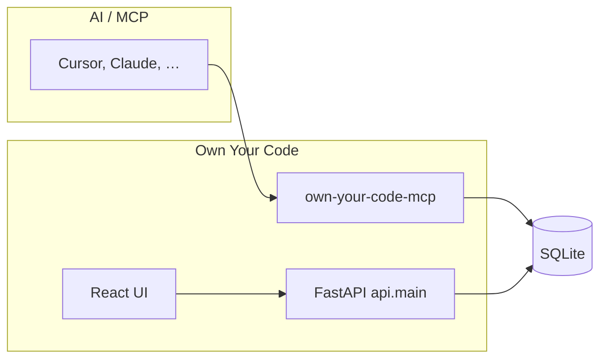

# Own Your Code

<p align="center">
  <strong>A living intent ledger for your codebase.</strong><br/>
  <sub>Capture the <em>why</em> behind every function — via MCP — and explore it in a browser or over REST.</sub>
</p>

<p align="center">
  <a href="https://pypi.org/project/own-your-code/"></a>
  
  
  <a href="https://github.com/khirodsahoo93/mcp-own-your-code"></a>
</p>

**Own Your Code** is an open-source **[Model Context Protocol](https://modelcontextprotocol.io/) (MCP) server** and optional **FastAPI + React** web app. It maintains an **intent ledger** (SQLite): for each function, capture *why* it exists, tradeoffs, decisions, and evolution—ideal for **AI-assisted development** in **Cursor**, **Claude Desktop**, **Windsurf**, **VS Code** (with MCP), and any other MCP host. **Package name:** `own-your-code` on **PyPI**; **repository:** [`mcp-own-your-code`](https://github.com/khirodsahoo93/mcp-own-your-code).

---

## Find Own Your Code

| Where | Install or URL |
|--------|----------------|
| **PyPI** | [`pip install own-your-code`](https://pypi.org/project/own-your-code/) — [`pypi.org/project/own-your-code`](https://pypi.org/project/own-your-code/) |
| **GitHub** | Source & issues: [`github.com/khirodsahoo93/mcp-own-your-code`](https://github.com/khirodsahoo93/mcp-own-your-code) |
| **npm** (optional shim) | [`npx own-your-code-mcp install`](https://www.npmjs.com/package/own-your-code-mcp) — [`npmjs.com/package/own-your-code-mcp`](https://www.npmjs.com/package/own-your-code-mcp) |

**Typical searches:** *own-your-code*, *own your code MCP*, *MCP intent ledger*, *codebase intent documentation*, *record why function exists*, *MCP server SQLite documentation*.

### MCP directories & registries (discovery)

Listing the project in public MCP catalogs helps people (and search engines) connect **“intent / codebase documentation MCP”** to this repo. Maintainer checklist—submit or claim when ready:

| Resource | Action |
|----------|--------|
| [Model Context Protocol](https://modelcontextprotocol.io/) | Official protocol site; see [registry / publishing](https://github.com/modelcontextprotocol/registry) and `mcp-publisher` for the official server registry. |
| [MCP.Directory — submit](https://mcp.directory/submit) | Submit GitHub URL + optional PyPI/npm metadata. |
| [MCP Server Directory](https://mcpserverdirectory.org/) | Community browse + submit flows (see site for current steps). |
| [MCPCentral — submit server](https://mcpcentral.io/submit-server) | Registry submission via publisher CLI. |

Search ranking depends on many factors (backlinks, relevance, competition). Using the **same names everywhere**—**Own Your Code**, **`own-your-code`**, **MCP intent ledger**—plus PyPI + GitHub + npm + directory listings, gives the strongest *discoverability* baseline you control from the repo.

---

### Documentation map

| Doc | Who it’s for |
|-----|----------------|
| **This README** | Install, configure, CLI, API, deploy — start here |
| [docs/USER-GUIDE.md](docs/USER-GUIDE.md) | Plain-language tour: pip, MCP, FastAPI, UI, mental models |
| [AGENTS.md](AGENTS.md) | **For MCP / AI assistants** — when to call `record_intent`, `record_evolution`, etc. (not maintainer-only) |
| [docs/CODING-PRACTICES.md](docs/CODING-PRACTICES.md) | Contributing and code conventions |
| [templates/PROJECT-INTENT.md](templates/PROJECT-INTENT.md) | Drop into repos so every session knows your expectations |

---

### Table of contents

1. [Find Own Your Code](#find-own-your-code)
2. [What you get](#what-you-get)
3. [Architecture (at a glance)](#architecture-at-a-glance)
4. [Requirements](#requirements)
5. [Quick start in five steps](#quick-start-in-five-steps)
6. [Install (all options)](#install-all-options)
7. [MCP host configuration](#mcp-host-configuration)
8. [Terminal CLI](#terminal-cli)
9. [Web UI and API](#web-ui-and-api)
10. [MCP tools](#mcp-tools)
11. [REST API](#rest-api)
12. [Search modes](#search-modes)
13. [Optional extras (semantic, multi-language)](#optional-extras-semantic-multi-language)
14. [Post-write hook](#post-write-hook)
15. [Production deployment](#production-deployment)
16. [Development](#development)
17. [Database schema](#database-schema)
18. [Publishing (maintainers)](#publishing-maintainers)
19. [License](#license)

---

## What you get

- **Intent** — User request, reasoning, implementation notes, confidence (`record_intent`).
- **Decisions** — Tradeoffs and alternatives you considered.
- **Evolution** — Timeline of behavioral changes (`record_evolution`).
- **Indexing** — Python, TypeScript, JavaScript, Go (pluggable extractors).
- **Search** — Keyword, semantic (embeddings), or hybrid.
- **Surfaces** — MCP (agents), **FastAPI + React UI** (humans), **CLI** (scripts, CI).

> **New to packaging or MCP?** Read [docs/USER-GUIDE.md](docs/USER-GUIDE.md) after skimming the steps below.

---

## Architecture (at a glance)



- **MCP** and **REST** share the same database (path from `OWN_YOUR_CODE_DB` or default `owns.db` in the server working directory).

---

## Requirements

- **Python 3.11+** (3.11, 3.12, 3.13 supported in CI).
- **Node.js** only if you build or develop the UI (`ui/`).

---

## Quick start in five steps

| Step | Action |
|:----:|--------|
| 1 | [Install](#install-all-options) the package (`pipx` / `pip` / source) so `own-your-code-mcp` is on your PATH. |
| 2 | Run `own-your-code install` (or merge JSON manually) — see [MCP host configuration](#mcp-host-configuration). |
| 3 | Restart your editor and call **`register_project`** with the absolute path to your repo. |
| 4 | While coding, use **`record_intent`** (and **`record_evolution`** when behavior changes). See [AGENTS.md](AGENTS.md). |
| 5 | Optional: run the [Web UI](#web-ui-and-api) to browse coverage, search, and timelines. |

---

## Install (all options)

### PyPI (recommended for end users)

```bash
pipx install own-your-code
own-your-code install
```

Or with `pip`:

```bash
python3 -m pip install own-your-code
own-your-code install --platform editor-a
```

`install` merges the MCP server block into known config files. **Platform IDs:**

| ID | Typical host |
|----|----------------|
| `editor-a` | Cursor (`~/.cursor/mcp.json`) |
| `editor-b` | Claude Desktop |
| `editor-c` | Windsurf / Codeium |
| `all` | Every location above |

Repeat `--platform` or use `all`. Inspect what would change: `own-your-code install --dry-run`.

### npm wrapper (still needs Python 3.11+)

```bash
npx own-your-code-mcp install
```

This ensures the Python package is installed, then runs the same `own-your-code install`. Prefer **`own-your-code-mcp` on PATH** for day-to-day MCP (lower latency than a Node shim).

### From source

```bash
git clone https://github.com/khirodsahoo93/mcp-own-your-code
cd mcp-own-your-code
python3 -m venv .venv && source .venv/bin/activate   # Windows: .venv\Scripts\activate
pip install -e .

# Optional capability bundles:
pip install -e ".[semantic]"   # embeddings + semantic/hybrid search
pip install -e ".[full]"       # semantic + tree-sitter TS/JS/Go
pip install -e ".[dev,full]"  # + pytest, ruff (contributors)
```

### Manual MCP JSON (skip `install`)

```bash
own-your-code print-config
```

If `own-your-code-mcp` is missing but **`uvx`** exists, `install` may write `uvx --from own-your-code own-your-code-mcp` (package must exist on PyPI).

---

## MCP host configuration

**After `own-your-code install`, restart the editor.**

The repo includes **[mcp.example.json](mcp.example.json)** as a minimal `mcpServers` fragment you can copy or diff against `own-your-code print-config`.

**From a git checkout** (example — adjust paths):

```json
{
  "mcpServers": {
    "own-your-code": {
      "command": "/path/to/.venv/bin/python",
      "args": ["-m", "src.server"],
      "cwd": "/path/to/mcp-own-your-code"
    }
  }
}
```

**When installed as a package:**

```json
{
  "mcpServers": {
    "own-your-code": {
      "command": "own-your-code-mcp",
      "args": [],
      "env": {}
    }
  }
}
```

Then in your MCP client, register and record intent (examples are illustrative; use your host’s tool UI):

```
register_project path="/absolute/path/to/your/project"
```

```
record_intent
  project_path="/absolute/path/to/your/project"
  file="src/auth.py"
  function_name="verify_token"
  user_request="Add JWT verification so the API rejects unsigned requests"
  reasoning="PyJWT + RS256; asymmetric keys for verify-only services."
```

---

## Terminal CLI

Same SQLite database as MCP. No editor required.

| Command | Purpose |
|---------|---------|
| `own-your-code --help` | All subcommands |
| `own-your-code install` | Merge MCP config into host JSON files |
| `own-your-code print-config` | Print `mcpServers` fragment |
| `own-your-code status [--project-path P]` | DB path; if cwd is inside a registered project, show its stats, else list projects (or use `--project-path`) |
| `own-your-code update [PATH]` | Scan/index a project (like `register_project`); **PATH defaults to the current directory** |
| `own-your-code prune [PATH] [--dry-run]` | Remove **stale** `functions` rows (and linked intents, etc.) not in a fresh scan; fixes inflated counts after narrowing skip rules |
| `own-your-code visualize [--project-path P] --out report.html` | Standalone HTML report; **P defaults to cwd** (must lie inside a registered root) |
| `own-your-code watch [--project-path P]` | Print coverage stats on an interval; **P defaults to cwd** |

Use `OWN_YOUR_CODE_DB` to point at a specific database file.

---

## Web UI and API

### Run the server

From the **repository root** (where `api/` and `pyproject.toml` live):

```bash
pip install -e . # or ensure fastapi + uvicorn are available
cd ui && npm ci && npm run build && cd ..   # first time: build static UI
uvicorn api.main:app --reload --host 127.0.0.1 --port 8002
```

Open **http://127.0.0.1:8002** — FastAPI serves **`ui/dist`** when present.

**Vite dev** (hot reload UI, API still on 8002):

```bash
# terminal 1
uvicorn api.main:app --reload --port 8002
# terminal 2
cd ui && npm install && npm run dev
```

Dev server: **http://localhost:5175** (proxies API routes to 8002).

If the API runs on another host or port, set **`VITE_API_PROXY`** (for example in `ui/.env.development`: `VITE_API_PROXY=http://127.0.0.1:8003`) so Vite proxies `/evolution`, `/projects`, and other API paths to the correct server. Without this, Timeline and other tabs can show a JSON parse error when the proxy hits the wrong process and returns HTML.

### Using the UI

1. In the header, enter the **absolute path** to your project and click **Register** (or pick a saved project).
2. Explore **Intent Map**, **Features**, **Search**, **Timeline**; open **Swagger** / **ReDoc** from the footer.
3. If **`OWN_YOUR_CODE_API_KEY`** is set on the server, use **API key…** in the footer so the browser sends `X-Api-Key` on data requests. **`/health`** and **`/server-info`** stay public.

### API docs

- **Swagger:** `http://127.0.0.1:8002/docs`
- **ReDoc:** `http://127.0.0.1:8002/redoc`
- **Server metadata:** `GET /server-info` (version, semantic deps, whether auth is enabled)

---

## MCP tools

| Tool | Description |
|------|-------------|
| `register_project` | Scan and index a codebase |
| `record_intent` | Record why a function exists |
| `record_evolution` | Log a behavioral change |
| `explain_function` | Intent, decisions, evolution for one function |
| `find_by_intent` | Keyword / semantic / hybrid search |
| `embed_intents` | Backfill embeddings for semantic search |
| `get_codebase_map` | Map, coverage, hook backlog |
| `get_evolution` | Evolution entries for one function |
| `annotate_existing` | Retrofit intents on legacy code |
| `mark_file_reviewed` | Clear hook backlog without new intent |

---

## REST API

| Method | Path | Description |
|--------|------|-------------|
| `GET` | `/health` | Health (public) |
| `GET` | `/server-info` | Version & capability flags (public) |
| `GET` | `/projects` | List projects |
| `POST` | `/register` | Register + index |
| `GET` | `/map` | Codebase map (`?file=` optional) |
| `GET` | `/function` | One function’s intent stack |
| `POST` | `/search` | Keyword / semantic / hybrid |
| `POST` | `/embed` | Start embed job |
| `GET` | `/embed/{job_id}` | Job status |
| `GET` | `/stats` | Coverage + backlog |
| `GET` | `/features` | Features |
| `GET` | `/evolution` | Project evolution timeline |
| `GET` | `/graph` | Graph payload for ReactFlow-style UIs |

Example:

```bash
curl -s -X POST http://127.0.0.1:8002/search \
  -H "Content-Type: application/json" \
  -d '{"project_path":"/path/to/repo","query":"payments","mode":"hybrid"}'
```

---

## Search modes

| Mode | When to use |
|------|-------------|
| **keyword** | Fast substring search over intent text |
| **semantic** | Natural-language similarity (run **`embed_intents`** / UI “Index embeddings” first) |
| **hybrid** | Blend keyword ranking + semantic score (`semantic_weight` tunable) |

---

## Optional extras (semantic, multi-language)

| Extra | Install | Enables |
|-------|---------|---------|
| `semantic` | `pip install "own-your-code[semantic]"` | `sentence-transformers`, numpy, vector search |
| `multilang` | `pip install "own-your-code[multilang]"` | tree-sitter parsers for TS/JS/Go |
| `full` | `pip install "own-your-code[full]"` | Both of the above |
| `dev` | `pip install "own-your-code[dev]"` | pytest, httpx, ruff |

Register with filters (REST body or MCP args as supported):

```json
{
  "path": "/my/project",
  "languages": ["python", "typescript"],
  "include_globs": ["src/**/*.ts", "src/**/*.py"],
  "ignore_dirs": ["vendor", "generated"]
}
```

**Default skips:** Indexing always skips common tooling and dependency trees (for example `node_modules`, `.git`, `.venv`, `.venv-pypi-test`, `.pytest_cache`, `.ruff_cache`, `site-packages`, `dist`, `build`, `htmlcov`, `Pods`, and paths under `*.egg-info`). Use `ignore_dirs` to add project-specific folder names.

| Language | Parser | Notes |
|----------|--------|--------|
| Python | `ast` | Always available |
| TypeScript / JavaScript | tree-sitter (optional) | Regex fallback without extra |
| Go | tree-sitter (optional) | Regex fallback without extra |

---

## Post-write hook

Tracks edited files so **`get_codebase_map`** can show a **hook backlog** until you **`record_intent`** or **`mark_file_reviewed`**.

```bash
cp hooks/post_write.py .git/hooks/post-write && chmod +x .git/hooks/post-write
# or, if installed:
own-your-code-hook
```

Wire the hook to your editor’s “after save” hook path as needed.

---

## Production deployment

### Environment variables

| Variable | Default | Meaning |
|----------|---------|---------|
| `OWN_YOUR_CODE_DB` | `owns.db` | SQLite path |
| `OWN_YOUR_CODE_API_KEY` | *(unset)* | Require `X-Api-Key` on data routes; SPA shell + `/assets` + `/health` + `/server-info` stay public |
| `OWN_YOUR_CODE_CORS_ORIGINS` | `*` | Comma-separated origins |
| `OWN_YOUR_CODE_EMBED_MODEL` | `all-MiniLM-L6-v2` | Embedding model name |

### Docker

```bash
docker compose up
```

Or:

```bash
docker build -t own-your-code .
docker run -p 8002:8002 \
  -e OWN_YOUR_CODE_API_KEY=your-secret \
  -e OWN_YOUR_CODE_CORS_ORIGINS=https://yourapp.com \
  -v "$(pwd)/data:/data" \
  -e OWN_YOUR_CODE_DB=/data/owns.db \
  own-your-code
```

### Render / Fly.io

A `render.yaml` is included. Set `OWN_YOUR_CODE_API_KEY` and `OWN_YOUR_CODE_DB` in the provider dashboard.

---

## Development

See [docs/CODING-PRACTICES.md](docs/CODING-PRACTICES.md).

```bash
pip install -e ".[dev,full]"
pytest
ruff check src/ api/ tests/
cd ui && npm ci && npm run build
```

CI runs on Python 3.11, 3.12, and 3.13.

---

## Database schema

SQLite tables (version via `PRAGMA user_version`; migrations are additive-safe):

| Table | Role |
|-------|------|
| `projects` | Registered roots |
| `functions` | Extracted functions |
| `intents` | Why a function exists |
| `intent_embeddings` | Vectors for semantic search |
| `decisions` | Tradeoffs |
| `evolution` | Change history |
| `features` / `feature_links` | Feature grouping |
| `hook_events` | Post-write backlog |

---

## Publishing (maintainers)

1. **PyPI** — Project `own-your-code` on [pypi.org](https://pypi.org); trusted publisher for this repo + `.github/workflows/release.yml` ([docs](https://docs.pypi.org/trusted-publishers/)).
2. **npm** — `npm login` or GitHub secret **`NPM_TOKEN`** for `npm/own-your-code-mcp`.
3. **Discovery** — After a release, submit or update listings in [MCP directories & registries](#mcp-directories--registries-discovery) so metadata stays in sync with the new version.

**Release:** bump `version` in `pyproject.toml` and `npm/own-your-code-mcp/package.json`, then tag:

```bash
git tag v0.1.0
git push origin main && git push origin v0.1.0
```

**Manual PyPI / npm:** use `python -m build` + `twine upload`, and `npm publish` from `npm/own-your-code-mcp`.

---

## License

MIT
