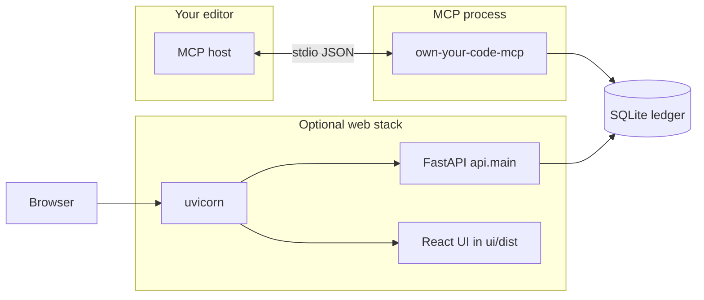

# User guide: PyPI, pip, MCP, FastAPI, and the UI

This guide is for anyone who is **new to Python packaging, web servers, and MCP**. You do **not** need prior experience with PyPI or FastAPI to follow it.

---

## 1. The big picture (one minute)

Own Your Code gives you **two different ways** to talk to the same SQLite “intent ledger”:

| Way | What it is | Typical use |
|-----|------------|-------------|
| **MCP** | Your **editor** starts a small program and talks to it over **stdin/stdout** | While coding: “record why this function exists” |
| **Web (FastAPI + browser UI)** | A **web server** listens on a **port**; the browser loads a **React** app | Explore the map, search, timelines in a tab |

They are **not** the same process:

- **MCP** = “assistant-driven, inside the editor.”
- **FastAPI + UI** = “human-driven, in the browser.”

Both can use the **same database file** (`owns.db` or `OWN_YOUR_CODE_DB`), so data you record via MCP can show up in the UI (and vice versa), as long as they point at the same project path and DB.



---

## 2. What is PyPI? What is pip?

- **PyPI** (Python Package Index) is a **public catalog** of Python libraries. Think “app store for Python code,” but everything is open and versioned (e.g. `own-your-code` version `0.1.4`).
- **pip** is the tool that **downloads** a package from PyPI (or another index) and **installs** it into **your** Python environment.

When you run:

```bash
python3 -m pip install own-your-code
```

pip:

1. Finds the package on PyPI.
2. Downloads a **wheel** (a zip-like archive of Python files + metadata).
3. Unpacks it into your environment’s `site-packages` folder.
4. Registers **console scripts** (commands you can type in the terminal), if the package defines any.

You do **not** get “the whole GitHub repo” — you only get **what the maintainers put inside the published package**.

---

## 3. What `pip install own-your-code` installs (this project)

This project’s **wheel** includes mainly:

- **`src/`** — MCP server, database logic, CLI installer, etc.
- **`api/`** — FastAPI app (`api.main:app`)

It does **not** currently ship the **built** React files (`ui/dist/`). So:

- After **pip install**, you **do** have `own-your-code-mcp` and `own-your-code` on your PATH (if your environment’s `bin` is on PATH).
- You **might not** have a `ui/dist` folder next to the installed code, so **opening the browser UI** may require a **git clone** + `npm run build` (see section 9).

### 3.1 Where pip saves Own Your Code (package vs data)

Three different things get “saved” in different places:

| What | Where it goes (typical) |
|------|-------------------------|
| **Python code** (`src`, `api`) | Inside your environment’s **`site-packages`** (e.g. `.venv/lib/python3.x/site-packages/`). You rarely edit this by hand. |
| **Commands** (`own-your-code`, `own-your-code-mcp`) | Small launchers in that environment’s **`bin/`** folder (e.g. `.venv/bin/own-your-code-mcp`). Your shell must have that folder on **PATH**. |
| **SQLite ledger** (`owns.db`) | **Not** “one DB per git repo” by default. The app picks a default file: if it detects a **git checkout** next to the code (`pyproject.toml` beside the package), it uses **`owns.db` in that repo root**. If you installed from a **wheel** (normal `pip install` from PyPI), it uses a **user data directory** so the app can write without touching `site-packages`. On macOS that’s under **`~/Library/Application Support/OwnYourCode/owns.db`**. You can override with **`OWN_YOUR_CODE_DB=/absolute/path/to/file.db`**. |

So: **pip does not install your ledger into each repo automatically.** One running MCP server uses **one** DB file (unless you change env vars). Inside that DB, **many projects** can be registered, each identified by **`project_path`** (absolute path to a repo root).

### 3.2 Different git repos — how does the AI “know” where to call MCP from?

Important distinction:

1. **Where the MCP program runs from**  
   The editor starts **`own-your-code-mcp`** using the **command in MCP config** (often just the name, resolved via PATH). That is **the same** no matter which folder you have open. It is **not** “one MCP copy per repo.”

2. **Which codebase you’re talking about**  
   Almost every tool takes an explicit **`project_path`** (and often **`file`**, **`function_name`**). Examples: `register_project path="/abs/path/to/repo-a"`, `record_intent project_path="/abs/path/to/repo-b" file="src/x.py" …`.

So the **AI does not guess the executable location per repo** — it uses **one** configured server. It **should** use the **correct `project_path`** for the repo you care about. That path usually comes from:

- **You** pasting or stating the path  
- The **editor workspace** / open folder (many assistants infer “current project root” from that)  
- **Rules or docs** in the repo (e.g. “always use `project_path=/Users/me/projects/foo`”)

If you work on **repo A** and **repo B** the same day, you either:

- **Register both** with `register_project` (each gets its own row in the DB), and always pass the right **`project_path`** on each call, or  
- Run **two MCP server entries** in config with different **`OWN_YOUR_CODE_DB`** env vars if you want **completely separate** databases (advanced).

**Summary:** Pip installs **one** tool on your machine. MCP config points the editor at **that** tool. **Which repo** is in scope is **`project_path` on each tool call**, not a separate pip install per repo.

### 3.3 Two kinds of “path” (easy to confuse)

| Kind | Name in the product | What it points to |
|------|---------------------|-------------------|
| **Ledger file path** | `OWN_YOUR_CODE_DB` env var (optional) | The **SQLite file on disk** (e.g. `/Users/you/data/ledger.db`). One file holds **all** registered projects, intents, evolution rows, etc. If unset, the app uses its **default** location (see §3.1) and still names the file **`owns.db`** unless you override the full path. |
| **Codebase root path** | `project_path` (and `path` in `register_project`) | The **root folder of a git repo or project** you’re documenting (e.g. `/Users/you/projects/my-app`). You can register **many** of these; each is a row in the `projects` table **inside** that one SQLite file. |
| **File path** | `file` on tools like `record_intent` | A path **relative to the project root** (e.g. `src/auth.py`), identifying **which file** a function lives in. |

So: **`OWN_YOUR_CODE_DB`** = “where is the database file?” **`project_path`** = “which customer repo is this tool call about?” **`file`** = “which file inside that repo?”

### 3.4 `owns.db` vs `own_your_code.db` vs `OWN_YOUR_CODE_DB`

- **`owns.db`** — This is the **default filename** the code uses for the SQLite ledger when it picks a path automatically (editable install: next to `pyproject.toml`; wheel install: under the user data directory). It is literally the string `owns.db` as the last component of the path.

- **`OWN_YOUR_CODE_DB`** — This is an **environment variable name** (all caps, underscores). It is **not** a file on disk by itself. You set it to an **absolute path** to **whatever** SQLite file you want, e.g. `/var/oyc/production.db`. That file can be named anything (`my-team.db`, `owns.db`, etc.).

- **`own_your_code.db`** — **Not used** by this project. Easy to mix up with:
  - the PyPI package **`own-your-code`** (hyphens), or  
  - the env var **`OWN_YOUR_CODE_DB`**, or  
  - the default **`owns.db`**.  
  If you see `own_your_code.db` somewhere, it’s either a typo, another tool, or someone’s custom filename they chose when setting `OWN_YOUR_CODE_DB`.

**Practical rule:** Think **one SQLite file** (default name **`owns.db`**, path varies) **or** set **`OWN_YOUR_CODE_DB`** to the exact file you want. Inside that file, **`project_path`** distinguishes each codebase you care about.

---

## 4. What is PATH? Why “add this to PATH”?

### 4.1 The idea (no jargon)

When you type a command like `python` or `own-your-code-mcp` in a terminal, the shell does **not** magically know where that program lives on disk. There are thousands of folders; the program could be `/usr/bin/python`, or `~/miniconda3/envs/llms/bin/python`, or `.venv/bin/python`, etc.

**PATH** is an **ordered list of folders** (directories) the shell checks, **in order**, looking for a file with that name that it can execute.

**Analogy:** PATH is like a **short list of drawers** to search when you say “get me the scissors.” If the scissors are in a drawer **not** on that list, the shell says **command not found** — even though the file exists somewhere else.

### 4.2 What “add X to PATH” means

It means: **put another folder onto that list** so programs inside that folder can be run by **short name**.

Example: pip installs `own-your-code-mcp` into:

`/Users/you/myproject/.venv/bin/own-your-code-mcp`

If **only** that folder were on PATH, you could type:

```bash
own-your-code-mcp
```

If `.venv/bin` is **not** on PATH, the shell won’t find it — you’d have to type the **full path** every time (or activate the venv, which prepends that `bin` to PATH for that session).

**“Add to PATH”** = edit your shell config (e.g. `~/.zshrc`) or use a tool installer that does it for you, adding a line like:

`export PATH="/something/bin:$PATH"`

so **that** folder is searched first (or at least searched).

### 4.3 Why it matters

- **Convenience:** run tools by name instead of pasting long paths.
- **Editors / MCP:** if the editor launches `own-your-code-mcp` by **name**, that executable must live in a directory on PATH **or** the config must give the **full path** to the binary.
- **Multiple Pythons:** the **order** of folders in PATH decides **which** `python` wins if several exist.

### 4.4 See your PATH (macOS / Linux)

```bash
echo $PATH
```

You’ll see something like `/usr/local/bin:/usr/bin:...` separated by colons.

### 4.5 Console scripts (how this ties to pip / pipx)

In `pyproject.toml`, this project declares commands like:

- `own-your-code` → CLI (e.g. `install`, `print-config`)
- `own-your-code-mcp` → starts the **MCP server** (stdio)

After install, pip creates small **launcher scripts** in your environment’s **`bin/`** directory (e.g. `~/.local/bin` or `.venv/bin`).

If `pip` says “installed” but `own-your-code-mcp` is **not found**, that **`bin`** folder is usually **not** on your PATH (and you didn’t activate the venv).

**Tip:** `pipx install own-your-code` is popular because pipx installs CLIs in a predictable place and reminds you to put pipx’s `bin` on PATH.

### 4.6 What the hell is `source`?

In the terminal, when you run a file, the shell can do it two ways:

| How it runs | What happens |
|-------------|----------------|
| **`./some-script.sh`** or **`bash some-script.sh`** | Often starts a **new** subshell. When the script ends, any changes it made (like changing `PATH`) **disappear** with that subshell. |
| **`source some-script.sh`** (same as **`. some-script.sh`** on many shells) | Runs the script **inside your current shell**. Changes like **`export PATH=...`** **stick** for that terminal window. |

So **`source .venv/bin/activate`** means: “run the **activate** script **in this shell**” so that:

- **`PATH`** gets the venv’s `bin` prepended (you can type `python` and get the venv’s Python).
- **`VIRTUAL_ENV`** might be set so tools know you’re “inside” that venv.

**`conda activate myenv`** is similar in spirit: conda changes your current shell’s environment (PATH, prompts, etc.) so `python` and `pip` point at **that** env.

**Why not just run `activate`?** If you executed `activate` as a normal program, it would run in a child process, set PATH there, exit, and **your** shell would be unchanged — useless. **`source`** is what makes the change **yours**.

---

## 5. MCP tools vs terminal CLI (e.g. code-review-graph style)

Many products offer **two surfaces** to the same engine:

| Surface | Who uses it | How it runs |
|---------|-------------|-------------|
| **MCP tools** | AI assistants inside an editor | Host launches `own-your-code-mcp`; tools are JSON-RPC calls over stdio. |
| **Terminal CLI** | You, in a shell | `own-your-code <subcommand>` — no MCP host required. |

They are **not** competing feature sets by design: **agents** are best served by MCP (structured tools, permissions in the host). **Humans** often want **flags, HTML files, and watch loops** without opening the assistant.

**Own Your Code** exposes both:

- **MCP:** `register_project`, `record_intent`, `get_codebase_map`, …
- **CLI:** `install`, `print-config`, **`status`** (optional `--project-path`; otherwise **infer from cwd** or list projects), **`update`** (optional path — defaults to **cwd**), **`prune`** (drop DB rows not in a fresh scan; use **`--dry-run`** first), **`visualize --out report.html`** (optional `--project-path`; defaults to **cwd**), **`watch`** (same).

Same **SQLite** database and **`project_path`** rules; use whichever fits the moment. The CLI can default to “this folder” because your shell’s cwd is your app repo; the MCP server usually is **not** started from that repo, so agents still pass an explicit **`project_path`**.

---

## 6. MCP in plain language

**MCP** (Model Context Protocol) is a **contract** between:

- an **MCP host** (often your editor, or a CLI that speaks MCP), and  
- an **MCP server** (a program you write — here, `own-your-code-mcp`).

### How the host runs the server

The host reads a **config file** (JSON) that says roughly:

- **command**: which executable to run (e.g. `own-your-code-mcp`)
- **args**: optional arguments
- **env**: optional environment variables

Then it **starts that program as a subprocess** and sends messages on **standard input**; the server replies on **standard output**. You usually **do not** “call MCP” manually — the **host** does it when you use a tool from the assistant.

### What you do as a user

1. Install the Python package (`pip` / `pipx`).
2. Run **`own-your-code install`** once (or merge JSON yourself) so the host’s config includes an `own-your-code` server block.
3. **Restart** the editor so it reloads MCP config.
4. In the product UI, use the tools exposed by the server (e.g. `register_project`, `record_intent`).

### Mental model

Think of MCP as **a plugin protocol**: the editor launches your plugin; the plugin speaks JSON messages; tools like `record_intent` are **remote procedures** the assistant can invoke.

---

## 7. What `own-your-code install` does

It does **not** install MCP globally by itself. It **merges** a snippet into known MCP config files (locations depend on `--platform` / OS).

That snippet tells the host: “to run Own Your Code MCP, execute **`own-your-code-mcp`** (or `python -m …` / `uvx …` depending on setup).”

So the chain is:

1. **pip** puts `own-your-code-mcp` on disk.
2. **install** makes the **editor config** point at that executable.
3. **Editor** starts the process when MCP loads.

To see the JSON without editing files:

```bash
own-your-code print-config
```

---

## 8. FastAPI and uvicorn (the web API)

- **FastAPI** is a Python library for building **HTTP APIs** (URLs like `/health`, `/map`, `/function`).
- **uvicorn** is an **ASGI server**: it binds to a **port** (e.g. `8002`) and runs your FastAPI app.

When you run (from a **clone** of the repo, with dependencies installed):

```bash
uvicorn api.main:app --reload --port 8002
```

you get:

- `http://127.0.0.1:8002/health` — API health
- `http://127.0.0.1:8002/server-info` — version, whether semantic embedding deps are installed, whether an API key is required (no secrets in the response)
- `http://127.0.0.1:8002/docs` and `/redoc` — interactive OpenAPI docs
- other `/map`, `/stats`, … endpoints used by the UI

If **`OWN_YOUR_CODE_API_KEY`** is set, those data endpoints expect **`X-Api-Key`**. The built UI footer can store a key in **localStorage** and attach it to API calls. **`/health`** and **`/server-info`** stay public so probes and the UI can still discover the server.

**Important:** This is a **separate** process from MCP. Starting uvicorn does **not** automatically start MCP, and vice versa.

---

## 9. React, `npm`, and `ui/dist`

The folder **`ui/`** holds **source** for the browser UI (React + Vite).

Browsers cannot run that source directly in production. You **build** it:

```bash
cd ui
npm install
npm run build
```

That produces **`ui/dist/`** — plain HTML, JS, and CSS files.

In this repo, **`api/main.py`** checks whether `ui/dist` exists. If it does, FastAPI **serves** those files so opening `http://127.0.0.1:8002` shows the app. If `ui/dist` is missing, you still have the **API**, but not the **clickable UI** from that URL.

That is why “I pip-installed from PyPI but I don’t see the UI” happens: the **wheel** doesn’t bundle `ui/dist` today.

### 9.1 “I opened the UI from `ui/` — how does it know my codebase?”

**It doesn’t guess.** The folder where you run `npm run dev` or the browser URL is **not** your “working project.” The UI is only a **front-end**; it loads data from the **API** by sending a **`project_path`** you choose.

**What you do:**

1. Run the **API** (`uvicorn api.main:app --port 8002`) — same machine, from the Own Your Code repo root (see §8).
2. Open the UI — either `http://127.0.0.1:8002` (built `dist`) **or** Vite dev `http://localhost:5175` (after `cd ui && npm run dev`), which **proxies** API calls to port **8002**.
3. In the header **project picker**, type the **absolute path** to the repo you care about (e.g. `/Users/you/projects/my-app`) and click **Register**, or pick a path you registered before.

After that, every tab (Intent Map, Timeline, …) uses **that** `project_path` on each request. You can switch projects from the same dropdown.

**Mental model:** The UI is like a mail client — it doesn’t “know” your house until you **enter an address**. **`project_path`** is that address.

---

## 10. Three practical ways to use Own Your Code

### A. MCP only (good match for PyPI)

1. `pipx install own-your-code` (or `pip install` in a venv).
2. `own-your-code install` (pick `--platform` as documented).
3. Restart editor; use MCP tools (`register_project`, `record_intent`, …).

### B. MCP + browser UI (needs clone + Node once)

1. Clone the repository.
2. Create venv; `pip install -e ".[dev]"` (or minimal deps you need).
3. `cd ui && npm install && npm run build`.
4. From repo root: `uvicorn api.main:app --reload --port 8002`.
5. Open `http://127.0.0.1:8002`, register your project path in the UI.

### C. Docker

If you use the project’s Docker setup, it’s another way to run the API (and possibly UI) with ports mapped — see `README.md` / `Dockerfile`.

---

## 11. Glossary

| Term | Meaning |
|------|---------|
| **PyPI** | Public index of Python packages. |
| **pip** | Installer that fetches packages into your Python environment. |
| **Wheel** | Built distribution format pip installs (`.whl`). |
| **`site-packages`** | Where installed Python libraries live. |
| **Console script** | Command added to `bin/` (e.g. `own-your-code-mcp`). |
| **MCP** | Protocol: host launches server, JSON over stdio, “tools” callable by the assistant. |
| **stdio** | Standard input/output of a process — MCP’s default transport here. |
| **FastAPI** | Python web framework for HTTP APIs. |
| **uvicorn** | Server that runs FastAPI on a port. |
| **React** | JavaScript library for browser UI. |
| **`ui/dist`** | Production build output of the React app (static files). |

---

## 12. Common confusion (quick answers)

**“I ran pip install; where is the code?”**  
Inside your Python environment under `site-packages` (plus scripts in `bin/`). Not necessarily next to your project folder.

**“How do I ‘call’ MCP?”**  
Usually you **don’t** call it by hand. Configure the host, then use the assistant/tools UI. Developers can also use MCP inspectors or other clients.

**“Is the UI required?”**  
No. Many people use **MCP only**. The UI is optional exploration.

**“Why two installs (pip + own-your-code install)?”**  
- **pip** installs the **program**.  
- **own-your-code install** updates **editor config** so the host knows **which program to run**.

---

## 13. Terminal, venv, “base” Python, and MCP (practical)

### 13.1 Why environments matter at all

A **Python environment** is a box that contains:

- a **`python`** executable  
- a **`pip`** that installs into **that box only**  
- **`site-packages`** (libraries) and **`bin/`** (commands like `own-your-code-mcp`)

**Base / system Python** = the Python that came with your OS or that you installed “globally.” If you `pip install` there, you mix **all projects** into one place. That can work but often causes “wrong version” headaches.

**venv** = a **small isolated box** per project (or per tool). `pip install` inside an **activated** venv only affects **that** venv.

**Rule of thumb:** Use a **venv per app you develop**, or use **pipx** for **CLI tools you want available everywhere** (see below).

### 13.2 Does Own Your Code go in “your” venv or base?

You have three sane options:

| Approach | Install command | Who sees `own-your-code-mcp` | Best when |
|----------|-----------------|------------------------------|-----------|
| **pipx** | `pipx install own-your-code` | Any program that runs the **full path** pipx wrote, or if pipx’s bin is on PATH | You want **one global** MCP binary; simplest for editors |
| **Dedicated venv for OYC** | `python3 -m venv ~/.venvs/oyc && source ~/.venvs/oyc/bin/activate && pip install own-your-code` | Only when that venv is **activated**, unless MCP config uses **absolute path** to `.../bin/own-your-code-mcp` | You want isolation without pipx |
| **Your app repo’s venv** | `cd my-app && source .venv/bin/activate && pip install own-your-code` | Only that app venv | You only use OYC while working on that repo |

**Why it matters for MCP:** Your editor’s MCP config says **which executable to launch**. That executable must be the **`own-your-code-mcp`** from the environment where you **actually installed** the package. If you install in venv A but the config points to venv B (or base), the server **won’t run** or will be the **wrong version**.

### 13.3 Does the terminal “current folder” matter?

- **`pip install` / `pipx install`:** folder usually **does not** matter; it matters which **`pip`** runs (which environment).
- **`own-your-code install`:** folder **does not** need to be your app repo; it **edits MCP config files** in your home directory (or platform-specific paths). You still need the **`own-your-code` command** on PATH from the right env.
- **`uvicorn api.main:app`** (browser UI): folder **does** matter — run from the **Own Your Code git repo root** (where `api/` and `pyproject.toml` live) so imports resolve. Use the Python that has **FastAPI + uvicorn** installed (often that repo’s venv).

### 13.4 Using MCP from the terminal (honest picture)

**Normal use:** you **don’t** drive MCP tools from the shell. The **editor** starts `own-your-code-mcp` and sends JSON over stdin.

**From the shell you typically:**

```bash
# See what would be added to MCP config
own-your-code print-config

# Merge server block into host config (after pip/pipx install)
own-your-code install --platform editor-a   # or your platform / all

# Run API + UI (from clone, with deps installed)
cd /path/to/mcp-own-your-code
source .venv/bin/activate   # if you use a venv
uvicorn api.main:app --reload --host 127.0.0.1 --port 8002
```

**Running the raw MCP server in a terminal** (`own-your-code-mcp`) **blocks** and expects **stdio JSON** — that’s for debugging or MCP inspector tools, not for day-to-day use.

### 13.5 Minimal “I just want it to work” recipe

1. Install once, globally isolated: **`pipx install own-your-code`**  
2. Ensure pipx’s bin is on PATH (pipx usually tells you).  
3. **`own-your-code install`** (pick platform).  
4. **Restart the editor.**  
5. Use MCP tools from the assistant; pass **`project_path`** to your real repo root.

Your **app’s** venv is for **your app’s** dependencies; it does **not** have to be the same place Own Your Code lives unless you **choose** to install OYC there and point MCP config at **that** `own-your-code-mcp` path.

### 13.6 `venv` vs Anaconda / Conda — is conda “global”?

**`venv`** (built into Python) creates a **small, isolated** environment: its own `python`, `pip`, `site-packages`, and `bin/`. It is **not global** — only projects that **activate** that venv see those packages. Nothing is shared unless you install into the same venv on purpose.

**Conda** (Anaconda / Miniconda) is a **separate** packaging system that also manages **isolated environments**:

| Thing | Global or not? |
|-------|----------------|
| **`conda create -n myenv …`** | **Not global.** `myenv` is its own prefix with its own Python and packages. You `conda activate myenv` to use it. |
| **Conda “base”** | This is conda’s **default** environment when you open a terminal. People often call it “global” in casual speech because it’s the **fallback**, but it is still **one conda env** — not “the whole OS.” Installing only into **base** mixes everything there (similar downsides to using system Python for everything). |
| **`conda install` vs `pip install`** | Inside an **activated** conda env, **`pip`** usually installs into **that env’s** `site-packages`. So pip + conda in the **same** activated env still targets **that** env, not “the world.” |

**Practical advice:**

- Treat **`conda create -n projectname`** like a **venv**: one env per project (or per role) is clean.
- Avoid piling every package into **`base`** if you want fewer version conflicts.
- For **Own Your Code**, you can `conda activate` an env and `pip install own-your-code` there — then point MCP config at **`…/envs/yourname/bin/own-your-code-mcp`** (or put that `bin` on PATH when the editor launches). Same rule as venv: **the editor must run the binary from the env where you installed it.**

**Summary:** Neither venv nor a named conda env is “global.” Only **base** (or true system Python) feels global because you use it by default — prefer **named envs** for isolation.

### 13.7 I installed packages in a conda env — how do I run my Python script?

Your script must run with the **Python from that same environment** (the one that has those packages). Two common ways:

1. **Activate, then run** (usual in a terminal):

   ```bash
   conda activate llms          # use your real env name
   python path/to/script.py     # or: python -m mypackage
   ```

2. **Full path, no activate** (fine for scripts and automation):

   ```bash
   /path/to/miniconda3/envs/llms/bin/python path/to/script.py
   ```

**Which terminal?** On macOS it does **not** have to be a special “Conda terminal.” Use **Terminal.app**, **iTerm**, or **Cursor’s integrated terminal** — they’re all normal shells. What matters is:

- Conda was set up with **`conda init`** for your shell (e.g. `zsh`), so `conda activate` works in that terminal, **or**
- You use the **full path** to that env’s `python` as above.

Anaconda Navigator’s “Open Terminal” is just a convenience; it’s not required.

**In Cursor / VS Code:** you can pick **Python: Select Interpreter** and choose your **`llms`** conda env — then Run/Debug uses that Python automatically without typing `conda activate` each time.

---

## 14. Where to go next

- **README.md** — quick start, MCP tool table, REST table, Docker notes.
- **Maintainers / packaging** — if you later want the UI **inside** the PyPI wheel, that’s a packaging change (build `ui/dist` in CI and include it in the Hatch layout).

If you tell us your OS and editor (and whether you use pipx or venv), we can turn section 10 into a copy-paste checklist tailored to you.
